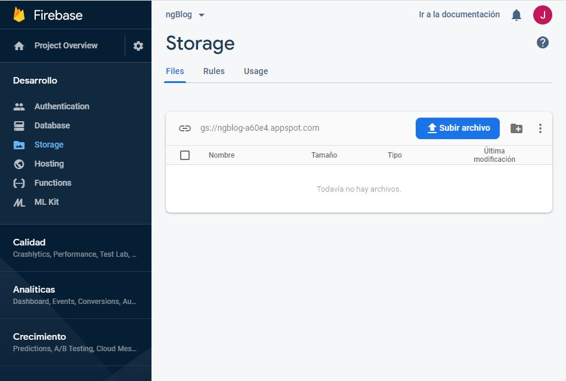

# Proyecto **Bitacora**

# Instalar Firebase CLI

[Doc](https://firebase.google.com/docs/cli?hl=es)

CLI --> Command Line Interface

- Descargar el fuente correspondiente a nuestro sistema operativo.  
- O bien usar npm para instalar el paquete correspondiente de manera global:
  > npm install -g firebase-tools

## Crear cuenta en firebase

Necesitamos crearnos un proyecto en firebase y configurarlo para poder obtener los datos de configuración y uso de la API y/o SDK.

## Comandos firebase CLI

> firebase logout --> cerrar sesion en firebase  
> firebase login --> iniciar sesion en firebase

## Instalar paquete angular firebase

> Necesitamos loguearnos antes en firebase. Nos pedirá que proyecto de nuestra cuenta firebase queremos asociar al proyecto angular.

Para gestionar nuestra cuenta firebase asociada al proyecto, necesitamos instalar el siguiente package:  

> ng add @angular/fire  

Una vez asociado el proyecto de firebase a nuestro proyecto angular, se crearán los siguientes archivos en la raiz del proyecto:  

- .firebaserc  
- firebase.json  

## Añadir importaciones en app.module.ts

```javascript
... 
/* Firebase */
import { AngularFirestoreModule } from '@angular/fire/firestore';
import { AngularFireStorageModule, StorageBucket } from '@angular/fire/storage';
import { AngularFireModule } from '@angular/fire';
import { environment } from '../environments/environment';
...

@NgModule({
  ...
  imports: [
    ...
    AngularFireModule.initializeApp(environment.firebaseConfig),
    AngularFirestoreModule,
    AngularFireStorageModule
  ],
  providers: [
    {
      provide: StorageBucket,
      useValue: `gs://${environment.firebaseConfig.storageBucket}`
    }
  ],
  ...
})
export class AppModule { }
```

El **StorageBucket** nos permite alojar/subir ficheros a la nube de firebase.
La sección **useValue** en **providers** se obtiene desde nuestra cuenta de firebase a la que asociamos nuestro proyecto.  

En la sección **Storage** fijarse en el detalle de la ruta de la carpeta, tiene el siguiente formato:  

> gs://(Dominio del StorageBucket) 

Por eso en el **useValue** especificamos ese formato.



## Configurar **rules** en la sección **Storage**

Para el modo de desarrollo necesitamos configurar la regla de la base de datos de nuestro proyecto Firebase, para que cualquier usuario pueda leer y escribir aún sin estar autentificado.  

Este comportamiento se modicará para **Producción**

La regla la cambiaremos de:  

> allow read, write: if request.auth != null;  

a  

> allow read, write;


# Instalar Angular Material
Ejecutar el siguiente comando desde la raiz del proyecto:

> ng add @angular/material  

Elegir un tema por defecto para:  

> Para este proyecto se elige Deep Purple/Amber  

Responder que sí a las siguientes preguntas:

> Set up HammerJS for gesture recognition? Y/n  
> Set up browser animations for Angular Material? Y/n

## Crear un módulo para componentes de Angular-Material

Se trata de una buena práctica crear un módulo para contener los componentes de Angular Material; luego este módulo
lo importamos a nuestro módulo raíz <app.module.ts> del proyecto.

> Esto nos permite añadir o eliminar componentes de Angular Material en función de nuestros requerimientos.

Para ello ejecutamos el siguiente comando para crear un modulo específico para los componentes de Angular Material:  

> ng g m material -m=app --flat

1. -m=app --> Añadir el modulo como importación en nuestro módulo raiz <app>
2. --flat --> Indica que no queremos que se cree nombre de directorio.

Recordar que nuestro nuevo modulo para los componentes Angular Material tiene que exportar tambien dichos componentes.

# Instalar FONTAWESOME

[package](https://www.npmjs.com/package/@fortawesome/angular-fontawesome)

Instalar los siguientes packages:

>  npm install @fortawesome/fontawesome-svg-core  
>  npm install @fortawesome/angular-fontawesome@0.5.x   
>  npm install @fortawesome/free-solid-svg-icons  
>  npm install @fortawesome/free-regular-svg-icons  
>  npm install @fortawesome/free-brands-svg-icons  

Tener en cuenta que los paquetes de iconos están segmentados por licencia y estilo:  

| Package name | Style | Prefix | Availabilty |
| ------------ | ----- | ------ | ----------- |
| @fortawesome/free-solid-svg-icons | Solid | fas | Free|
| @fortawesome/free-regular-svg-icons | Regular | far | Free|
| @fortawesome/free-brands-svg-icons | Brands | fab | Free|

## Usando iconos FontAwesome

> Añadir el módulo **FontAwesome** en el módulo que contenga la plantilla donde queramos mostrar los iconos. (En nuestro caso **layout.module.ts**).  

```javascript
import { FontAwesomeModule } from '@fortawesome/angular-fontawesome';

@NgModule({
  ...
  imports: [
    ...
    FontAwesomeModule,
    ...
  ],
  exports: [
    ...
  ]
})
export class LayoutModule { }
```

> Luego en el componente correspondiente utilizar el paquete que contenga el icono deseado, **Solid**, **Regular** o **Brands** o cualquier combinación de ellos.  

Para el icono del logo de Angular usamos:

```javascript
import { faAngular, IconDefinition } from '@fortawesome/free-brands-svg-icons';

@Component({
  selector: 'app-header',
  templateUrl: './header.component.html',
  styleUrls: ['./header.component.scss']
})
export class HeaderComponent implements OnInit {

  logoAngular: IconDefinition = faAngular;

  readonly brand: string;
  readonly portfolio: string;
  readonly version: string;

  constructor(public srvAuth: AuthService) {
    this.brand = 'Bitácora';
    this.version = 'v1.0';
    this.portfolio = LinksMenu.PORTFOLIO;
   }

  ngOnInit() {
  }
}

```

> Por último, usaremos el icono en nuestra plantilla HTML.  

```html
<span class="mat-button-wrapper">
  <fa-icon [icon]="logoAngular" class="logoAngular"></fa-icon>
  <span>{{ brand }} | {{ version }}</span>
</span>
```

# Layout  

Crearemos un módulo llamado **layout** con el con que vamos a estructuar las partes fijas del site con los siguientes módulos:  
- Header  
- Footer  

En el directorio **pages** crearemos otro módulo llamado **container-app** donde formatearemos:
- Header  
- Body --> será la salida del <router-outlet>  
- Header 

La parte pública tendra un esquema de configuración distinto a la parte privada.  
Para poder acceder a la parte privada abrá que disponer de credenciales válidas para poder loguearse en el sistema; para nuestro proyecto usaremos FIREBASE.

# Páginas 

Las paginas de navegación principales, las vamos a crear dentro del directorio **/app/pages/**.  
Cada página estará representada por un módulo que contendrá el componente, el routing (lazy_load) y los servicios oportunos.

Para ello ejecutaremos el siguiente comando:  

> ng g module pages/home -m=layout --route home  

Con este comando se añade la ruta en nuestro fichero de routing principal **layout-routing.module.ts** creando el registro **lazy-loading** para la ruta especificada.

